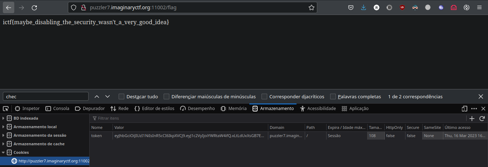
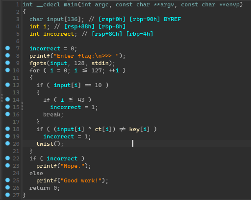
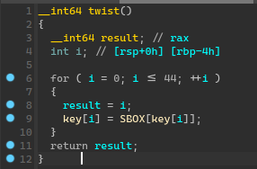
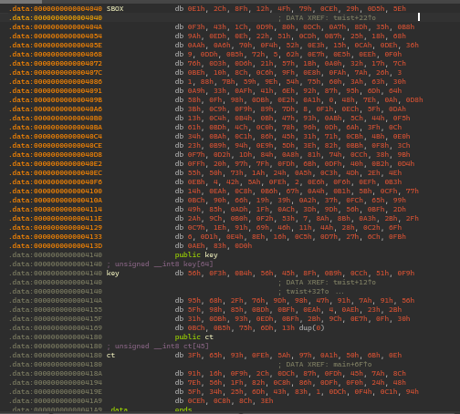
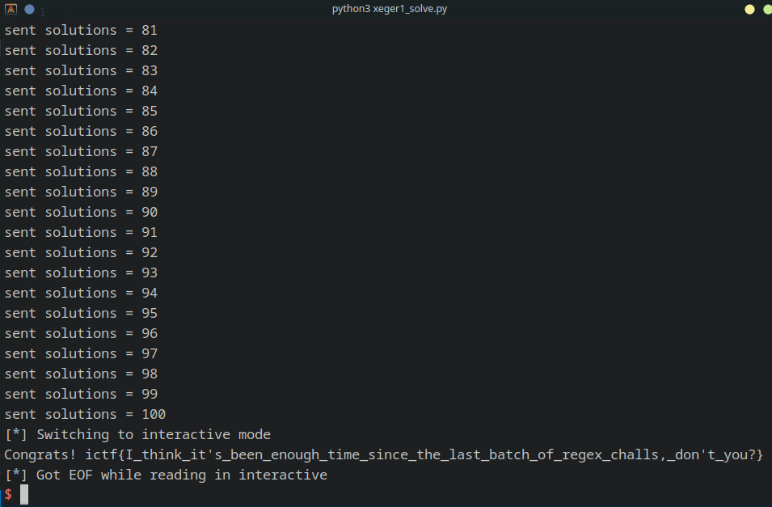
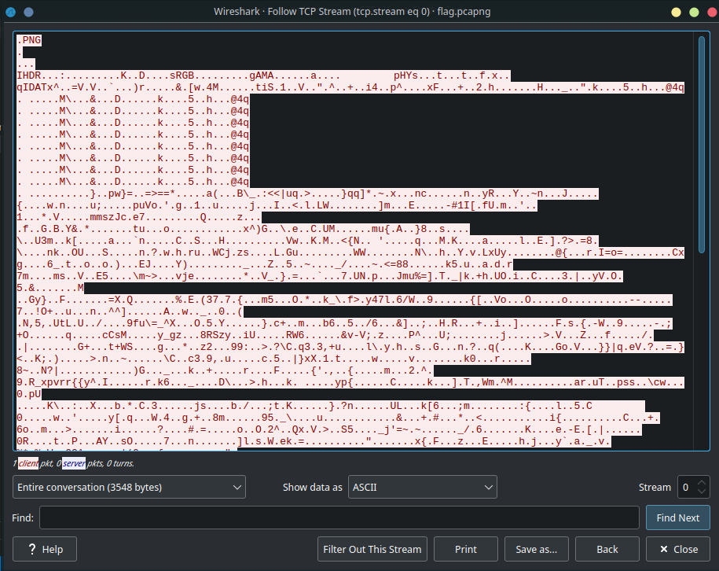
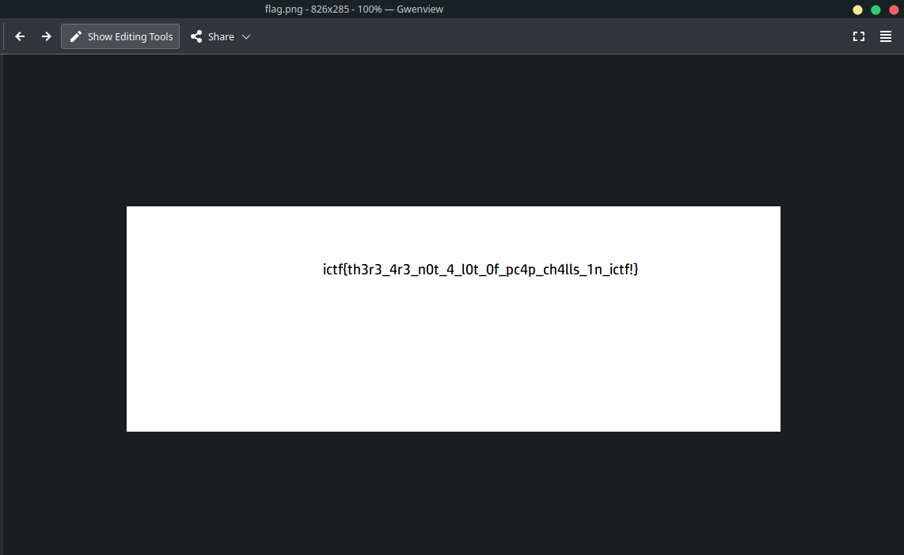

Some writeups of my CTF (dumb) solutions from "ImaginaryCTF". (*spoiler alert*)

## Table of contents
- [Table of contents](#table-of-contents)
- [Introduction](#introduction)
- [web](#web)
  - [Just Web Things (50pts)](#just-web-things-50pts)
    - [Description](#description)
    - [Attachments](#attachments)
    - [Solution](#solution)
- [rev](#rev)
  - [Revving Up (75pts)](#revving-up-75pts)
    - [Description](#description-1)
    - [Attachments](#attachments-1)
    - [Solution](#solution-1)
  - [Snake (75pts)](#snake-75pts)
    - [Description](#description-2)
    - [Attachments](#attachments-2)
    - [Solution](#solution-2)
- [pwn](#pwn)
- [crypto](#crypto)
- [misc](#misc)
  - [Xeger1 (75pts)](#xeger1-75pts)
    - [Description](#description-3)
    - [Attachments](#attachments-3)
    - [Solution](#solution-3)
- [forensics](#forensics)
  - [Wireshark! (50pts)](#wireshark-50pts)
    - [Description](#description-4)
    - [Attachments](#attachments-4)
    - [Solution](#solution-4)

## Introduction
Some writeups of my (dumb) solutions for [ImaginaryCTF](https://imaginaryctf.org).

## web

### Just Web Things (50pts)

#### Description
- Just a little web app I made to play with some web things. Have fun!

#### Attachments
- http://puzzler7.imaginaryctf.org:11002

#### Solution
Looking at the source code, we can see that is some sort of API written in python + flask.

```py
@app.route('/flag')
@limiter.limit("5/second")
def flag_endpoint():
    if "token" not in request.cookies:
        ret = redirect("/flag")
        ret.set_cookie("token", get_new_cookie())
        return ret
    if check_cookie(request.cookies.get("token")):
        return open("flag.txt").read()
    else:
        return "Only admins can view the flag!"
```

There is the `/flag` route, where we can see that it returns the flag if `check_cookie` returns true.

```py
def check_cookie(cookie):
    return jwt.decode(cookie, options={"verify_signature": False}, algorithms="HS256").get("user", "") == "admin"
```

And `check_cookie` returns true if the `"user"` cookie decoded is `"admin"`.
By default it sets the cookie token as `"normal"`:
```py
def get_new_cookie():
    return jwt.encode({"user": "normal"}, secret, algorithm="HS256")
```

My solution was to simple generate a JWT token [here](https://jwt.io/) as the following:
```json
{
  "user": "admin"
}
```
And manually overwrite the browser cookie so I could access `/flag` route.




## rev

### Revving Up (75pts)

#### Description

Following the trend of popular demand, here's some rev!

#### Attachments
- https://imaginaryctf.org/f/szzlr#revving_up

#### Solution

Opening the binary with IDA and use the very good decompiler :), this is what we got:



We can see that it reads user input, and xor's it with some `ct[i]` data and checks if its the correct character (`key[i]`) and then it calls this `twist()` function.



We can see that the key changes every iteration with this `twist` function, so my plan was to "re-create" this myself in a python script.

Boring part: converting all the hex bytes from IDA to python formatted bytes (for example `5Ah` to `0x5A`) ._.



Anyways, the script looks like this:

```py
SBOX = [
    0x0E1, 0x2C, 0x8F, 0x12, 0x4F, 0x79, 0x0CE, 0x29, 0x0D5, 0x5E,
    0x0F3, 0x43, 0x1C, 0x0D9, 0x80, 0x0DC, 0x0A7, 0x8D, 0x35, 0x0B8,
    0x9A, 0x0ED, 0x0E, 0x22, 0x51, 0x0CD, 0x0B7, 0x25, 0x18, 0x68,
    0x0AA, 0x0A6, 0x70, 0x0F4, 0x52, 0x0E3, 0x15, 0x0CA, 0x0DE, 0x36,
    0x09, 0x0DD, 0x0B5, 0x72, 0x05, 0x62, 0x0E7, 0x0E5, 0x0EE, 0x0F0,
    0x76, 0x0D3, 0x0D6, 0x21, 0x57, 0x1B, 0x0A0, 0x32, 0x17, 0x7C,
    0x0BE, 0x10, 0x8C, 0x0C6, 0x9F, 0x0E8, 0x0FA, 0x7A, 0x26, 0x03,
    0x01, 0x88, 0x7B, 0x59, 0x9E, 0x54, 0x75, 0x60, 0x3A, 0x63, 0x30,
    0x0A9, 0x33, 0x0AF, 0x41, 0x6E, 0x92, 0x87, 0x95, 0x6D, 0x64,
    0x58, 0x0F, 0x98, 0x0DB, 0x0E2, 0x0A1, 0x00, 0x48, 0x7E, 0x0A, 0x0D8,
    0x3B, 0x0C9, 0x0F9, 0x89, 0x7D, 0x08, 0x0F1, 0x0EC, 0x5F, 0x0DA,
    0x13, 0x0C4, 0x0B4, 0x0B, 0x47, 0x93, 0x0AB, 0x5C, 0x44, 0x0F5,
    0x61, 0x0BD, 0x4C, 0x0C0, 0x78, 0x96, 0x0D, 0x6A, 0x3F, 0x0C,
    0x34, 0x0BA, 0x0C1, 0x86, 0x45, 0x31, 0x71, 0x0CB, 0x4B, 0x0E0,
    0x23, 0x0B9, 0x94, 0x0E9, 0x5D, 0x3E, 0x82, 0x0BB, 0x0F8, 0x3C,
    0x0F7, 0x0D2, 0x1D, 0x84, 0x0A8, 0x81, 0x74, 0x0CC, 0x38, 0x9B,
    0x0FF, 0x20, 0x97, 0x7F, 0x0FD, 0x6B, 0x0DF, 0x40, 0x0B2, 0x0D4,
    0x55, 0x50, 0x73, 0x1A, 0x24, 0x0A5, 0x0C3, 0x4D, 0x2E, 0x4E,
    0x0EB, 0x04, 0x42, 0x5A, 0x0FE, 0x02, 0x0E6, 0x0F6, 0x0EF, 0x0B3,
    0x14, 0x0EA, 0x0C8, 0x0B6, 0x67, 0x0A4, 0x0B1, 0x5B, 0x0CF, 0x77,
    0x0BC, 0x90, 0x66, 0x19, 0x39, 0x0A2, 0x37, 0x0FC, 0x65, 0x99,
    0x49, 0x85, 0x0AD, 0x1F, 0x0AC, 0x3D, 0x9D, 0x56, 0x0BF, 0x2D,
    0x2A, 0x9C, 0x0B0, 0x0F2, 0x53, 0x07, 0x8A, 0x8B, 0x0A3, 0x2B, 0x2F,
    0x0C7, 0x1E, 0x91, 0x69, 0x46, 0x11, 0x4A, 0x28, 0x0C2, 0x6F,
    0x06, 0x0D1, 0x0E4, 0x8E, 0x16, 0x0C5, 0x0D7, 0x27, 0x6C, 0x0FB,
    0x0AE, 0x83, 0x0D0
]

key = [
    0x56, 0x0F3, 0x0B4, 0x56, 0x45, 0x8F, 0x0B9, 0x0CC, 0x51, 0x0F9,
    0x95, 0x68, 0x2F, 0x76, 0x9D, 0x98, 0x47, 0x91, 0x7A, 0x91, 0x56,
    0x5F, 0x98, 0x85, 0x0BD, 0x0BF, 0x0EA, 0x4, 0x0AE, 0x23, 0x2B,
    0x31, 0x0DB, 0x93, 0x0ED, 0x0BF, 0x2B, 0x9C, 0x0E7, 0x0F, 0x30,
    0x0BC, 0x0B5, 0x75, 0x6D, 0x13
]

ct = [
    0x3F, 0x65, 0x93, 0x0FE, 0x5A, 0x97, 0x0A1, 0x50, 0x6B, 0x0E,
    0x91, 0x16, 0x0F9, 0x2C, 0x0DC, 0x87, 0x0FD, 0x45, 0x7A, 0x8C,
    0x7E, 0x56, 0x1F, 0x82, 0x0C8, 0x86, 0x0DF, 0x0F0, 0x24, 0x48,
    0x5F, 0x34, 0x25, 0x6D, 0x43, 0x83, 0x01, 0x0DC, 0x0F4, 0x0C1, 0x94,
    0x0CE, 0x0C8, 0x8C, 0x3E
]

def twist():
    global key
    for i in range(len(key) - 1):
        key[i] = SBOX[key[i]]


flag = ""

for i in range(len(key) - 1):
    for c in range(127):
        if (c ^ ct[i] == key[i]):
            flag += chr(c)
            twist()
            break

print(flag)
```

Boom:
```py
❯ python revving.py
ictf{don't_worry_we're_just_getting_st@rted}
```

### Snake (75pts)

#### Description
- I always thought a chain of lambdas reminded me of a snake, so here's some python lambdas.

#### Attachments
- https://imaginaryctf.org/f/pw4h2#snake.py

#### Solution

Ok this was a bit though and I had to do some trickery to do it, but I got it XD.

The given python file has a massive line with chained lambdas, but if we look carefully, they simply check that at least one of the conditions is true at each step.

```py
check = lambda _:any([_[6]==95,_[5]==33,_[14]==95]) and (lambda _:any([_[19]==95,_[6]==71,_[18]==39]) and # etc...
```

As you can see, it checks if index `[6]` is `95` (ASCII value).
So my solution was to:
- extract all those pairs (`6` to `95`, `5` to `33`, etc...)
- since there were alot of repeated ones, i only keep the ones with more "appearences" (thanks chagpt for helping me on this part xD)
- convert the ascii values to characters and generating the flag string

So this is my solution:
```py
import re

line = ""
with open('snake.py', 'r') as file:
    lines= file.readlines()
    line = lines[2]

pairs = re.findall(r"_\[(\d+)\]\=\=(\d+)", line)

# pairs is something like: [('6', '95'), ('5', '33'), ('14', '95'), ('19', '95'), .... ]

################################ (thanks chatgpt)
# will store the pairs with most appearences
from collections import Counter
new_pairs = []
# Create a dictionary to count the frequency of each second element
d = {}
for key, value in pairs:
    if key not in d:
        d[key] = []
    d[key].append(value)
# Find the most common element in each value list 
# and create a new list of pairs using those values
for key in d:
    most_common = Counter(d[key]).most_common(1)[0][0]
    new_pairs.append((key, most_common))
########################################

flag_size = len(new_pairs)+1
flag = [''] * flag_size

for a, b in new_pairs:
    index = int(a)
    asci = int(b)
    flag[index] = chr(asci)

print("".join(flag))
```

And boom!
```
❯ python3 snake_sol.py
ictf{I_b3t_y0u_ju5t_used_z"}
```

But wait.... this is not right D:

Well, the pair filtering algorithm from ChatGPT "fails" when there are draws at the pair appearences.
In this case, index `26` could be ASCII `34`, `51`, `36`, or `50`, as each of them appears twice.

So, getting the ASCII value of each one, we get:
- `34`: `"` (double quotation mark)
- `36`: `$` (dollar sign)
- `50`: `2` (digit 2)
- `51`: `3` (digit 3)

After some trial error, the correct flag is `ictf{I_b3t_y0u_ju5t_used_z3}`. (*where I suppose "z3" is some algorithm that I should've used and I did not, LOL!*)

*Thanks god only the last index failed x]....*

## pwn

## crypto

## misc

### Xeger1 (75pts)

#### Description
- I've had you generating regrets to match strings before, but never the other way around - let's see how this goes.

#### Attachments
- `nc puzzler7.imaginaryctf.org 11003`
- https://imaginaryctf.org/f/oqui5#xeger1.py

#### Solution


```py
#!/usr/bin/env python3

from re import fullmatch
from time import time
from random import choice, randint

clear = '\x1b\x5b\x48\x1b\x5b\x32\x4a\x1b\x5b\x33\x4a'

def die(*args):
    print(*args)
    exit()

def gen_entity():
    alphabet = 'abcdefghijklmnopqrstuvwxyz'
    return '[' + ''.join(choice(alphabet) for i in range(randint(2, 8))) + ']'

def gen_length():
    length = randint(1, 10)
    if length == 1:
        return ""
    else:
        return f"{{{length}}}"

def gen_regex():
    length = randint(2, 5)
    return ''.join(gen_entity()+gen_length() for _ in range(length))

def puzzle(n):
    rx = gen_regex()
    print(clear, end='')
    print('='*80)
    print(f'** Regex #{n} **\n')
    print('Please generate a string to match the regex:')
    print(f'\t{rx}\n')
    inp = input("Enter string:\n>>> ")
    if fullmatch(rx, inp) is None:
        die("Input did not match!")

def main():
    solved = 0
    start = time()
    while solved < 100:
        solved += 1
        puzzle(solved)
        if time() - start > 180:
            die("Out of time!")
    die(f"Congrats! {open('flag.txt').read()}")


if __name__ == '__main__':
    main()
```

Looking at the source code, you can see that the `puzzle` function is the main point of this CTF: it generates a random regex pattern and asks user for a string, the string needs to match the pattern. In order to get the flag, you have to solve this 100 times.

My approach was to create a simple python script that connects to the server, reads the pattern, generates a string, and loop this until we can get the flag.

```py
from pwn import *

# generates string that matches [pattern] regex
def get_str_from_regex(pattern, pattern_length):
    charset = ''.join(set(re.findall(r'\[([^\]]+)\]', pattern)))
    string = ''.join(charset[1] for _ in range(pattern_length))
    return string

# returns pattern length, e.g: "[xuz]{3}"" returns 3, "[aka]" returns None
def get_length_from_pattern(pattern):
    match = re.match(r"\[([^\[\]]+)\]\{(\d+)\}", pattern)
    if not match:
        return None
    length = int(match.group(2))
    return length

# main
def main():
    server = 'puzzler7.imaginaryctf.org'
    port = 11003
    conn = remote(server, port)
    conn.recv()
    sent = 0 # sent solution strings

    # print the output message
    while True:
        str = conn.recv().decode().split("\n")
        pattern = str[4].strip() # str[4] is the regex pattern
        # split patterns so its faster
        patterns = re.findall(r"\[[^\[\]]+\](?:\{\d+\})?", pattern)
        solution = "" # for each pattern, we generate the solution string and append to this variable
        for p in patterns:
            pattern_length = get_length_from_pattern(p)
            if pattern_length == None:
                solution += p[1] # [asdf] has no {x}, so we can just input 1 char
            else:
                solution += get_str_from_regex(p, pattern_length)[0:pattern_length]

        conn.sendline(solution)
        sent += 1
        print("sent solutions = {}".format(sent))
        if sent == 100:
            conn.interactive()
        else:
            conn.recv()

if __name__ == "__main__":
    main()
```

The script should be easy to understand and follow.



## forensics

### Wireshark! (50pts)

#### Description
- Wireshark is fun!

#### Attachments
- https://imaginaryctf.org/f/iTzDw

#### Solution

Opening the `pcapng` file using Wireshark, we can follow the TCP stream and we get the following:



It looks like a `png` image (because it starts with `.PNG` (?) idk xD), so I exported the data (using `Export Packet Bytes`) and saved as a `.png` file.




