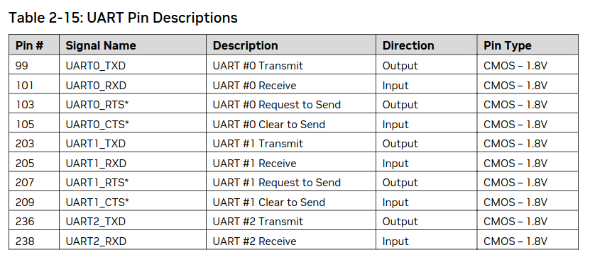

- [Context](#context)
- [Setup](#setup)
- [Device tree](#device-tree)
- [Diving into the Kernel](#diving-into-the-kernel)
- [Applying Kernel patch to Yocto](#applying-kernel-patch-to-yocto)
- [Did it work?](#did-it-work)
- [References](#references)

### Context

When developing custom carriers for embedded modules/computers, or perhaps, want to mess around with the device low-level configuration, new pin assignments and functions often need to be created. However, this is not a straightforward process. It requires a significant amount of knowledge about Yocto, the specific BSP layer you're working with (such as [meta-tegra](https://github.com/OE4T/meta-tegra), etc.), and the Linux kernel itself.

In this post, I’ll walk you through a simple process I used to add support for a new UART on a custom Linux image built with Yocto, on the NVIDIA Orin NX, by modifying the kernel device tree.

### Setup

The Orin NX module has three UART interfaces:



| Module UART# | SOC UART# | Used Pins              | <uart*>@<address> | <node>  | Usage        |
| ------------ | --------- | ---------------------- | ----------------- | ------- | ------------ |
| UART0        | SOC UART2 | PX04, PX05, PX06, PX07 | uartb@3110000     | serial1 | Unused       |
| UART1        | SOC UART1 | PR02, PR03, PR04, PR05 | uarta@3100000     | serial0 | /dev/ttyTHS0 |
| UART2        | SOC UART3 | PCC05, PCC06           | uartc@c280000     | serial2 | /dev/ttyTCU0 |

The goal here is to enable `uartb`, as it’s disabled by default, so we can have three functional UARTs in our module!

### Device tree

> A Linux Device Tree is a data structure used to describe the hardware components of a system, such as CPUs, memory, buses, and peripherals, so that the operating system can configure and use the hardware properly. It is typically represented in .dts (source) and .dtb (binary) files.

The first step is to identify the device tree that our board uses. This can be done by checking the machine configuration in the Yocto BSP layer. In this case, I'm using an Orin NX 16 GB, so I referred to [p3768-0000-p3767-0000.conf](https://github.com/OE4T/meta-tegra/blob/kirkstone/conf/machine/p3768-0000-p3767-0000.conf) file in the [meta-tegra](https://github.com/OE4T/meta-tegra) repository.

### Diving into the Kernel

Next, we need to dive deeper into the kernel to search for the existing UART nodes, allowing us to add the new one. This layer uses a custom kernel, [OE4T/linux-tegra](https://github.com/OE4T/linux-tegra-5.10). Let's tart by examining what the device tree includes. For instance, the [`tegra234-p3767-0000-p3768-0000-a0.dts`](https://github.com/OE4T/linux-tegra-5.10/blob/oe4t-patches-l4t-35.5.0/nvidia/platform/t23x/p3768/kernel-dts/tegra234-p3767-0000-p3768-0000-a0.dts#L24) file includes [`cvb/tegra234-p3768-0000-a0.dtsi`](https://github.com/OE4T/linux-tegra-5.10/blob/oe4t-patches-l4t-35.5.0/nvidia/platform/t23x/p3768/kernel-dts/cvb/tegra234-p3768-0000-a0.dtsi#L213-L228), which contains the following relevant sections:

```dts
serial@3100000 {/* UARTA, for 40 pin header */
    status = "okay";
};

mttcan@c310000 {
    status = "okay";
};

serial@3140000 {
    /* UARTE, Goes to M2.E and also some of the pins to bootstrap */
    status = "okay";
};

serial@31d0000 {/* UARTI - SBSA */
    status = "okay";
};
```

So, huh, easy right? Adding the following should just work:

```dts
serial@3110000 {/* UARTB */
    status = "okay";
};
```

**Wait... Make sure that the address `serial@3110000` is not being used by other nodes or verify by checking if the same device pins are not used by another node (you can find this information in the pinmux excel sheet or data sheet)**.

After some search, only `uartb` uses it.

```dts
uartb: serial@3110000 {
	compatible = "nvidia,tegra194-hsuart";
	iommus = <&smmu_niso0 TEGRA_SID_NISO0_GPCDMA_0>;
	dma-coherent;
	reg = <0x0 0x03110000 0x0 0x10000>;
	reg-shift = <2>;
	interrupts = <0 TEGRA234_IRQ_UARTB 0x04>;
	nvidia,memory-clients = <14>;
	dmas = <&gpcdma 9>, <&gpcdma 9>;
	dma-names = "rx", "tx";
	clocks = <&bpmp_clks TEGRA234_CLK_UARTB>,
		<&bpmp_clks TEGRA234_CLK_PLLP_OUT0>;
	clock-names = "serial", "parent";
	resets = <&bpmp_resets TEGRA234_RESET_UARTB>;
	reset-names = "serial";
	status = "disabled";
};
```

### Applying Kernel patch to Yocto

So, to apply this in our custom Linux image, I usually do the *hacky-patch-way*.

```
git add .
git commit -m "add uart b"
git format-patch -1
```

then, you can create something like `linux-tegra_5.10%.bbappend` and patch as the usual
```make
FILESEXTRAPATHS:prepend := "${THISDIR}/files:"

SRC_URI += "file://0001-add-uart-b.patch"
```

### Did it work?

```sh
root@p3768-0000-p3767-0000:~# dmesg | grep tty
[    0.000000] Kernel command line: mminit_loglevel=4 console=ttyTCU0,115200 firmware_class.path=/etc/firmware fbcon=map:0 net.ifnames=0 nospectre_bhb ipv6.disable=1 audit=0 ipv6.disable=1 audit=0 
[    0.264673] 31d0000.serial: ttyAMA0 at MMIO 0x31d0000 (irq = 66, base_baud = 0) is a SBSA
[    1.873125] printk: console [ttyTCU0] enabled
[    3.746453] 3100000.serial: ttyTHS0 at MMIO 0x3100000 (irq = 17, base_baud = 0) is a TEGRA_UART
[    3.761178] 3110000.serial: ttyTHS1 at MMIO 0x3110000 (irq = 63, base_baud = 0) is a TEGRA_UART
[    3.776142] 3130000.serial: ttyTHS3 at MMIO 0x3130000 (irq = 64, base_baud = 0) is a TEGRA_UART
[    3.790859] 3140000.serial: ttyTHS4 at MMIO 0x3140000 (irq = 65, base_baud = 0) is a TEGRA_UART
[    6.545598] systemd[1]: Created slice Slice /system/getty.
[    6.548166] systemd[1]: Created slice Slice /system/serial-getty.
```

As you can see, we have a new UART port at `/dev/ttyTHS1`:
```
[    3.761178] 3110000.serial: ttyTHS1 at MMIO 0x3110000 (irq = 63, base_baud = 0) is a TEGRA_UART
```

Cool!

### References
- [Jetson Orin NX Series Modules Data Sheet](https://developer.nvidia.com/downloads/jetson-orin-nx-module-series-data-sheet)
- [meta-tegra](https://github.com/OE4T/meta-tegra)
- [OE4T/linux-tegra](https://github.com/OE4T/linux-tegra-5.10)
- [yocto](https://docs.yoctoproject.org/)