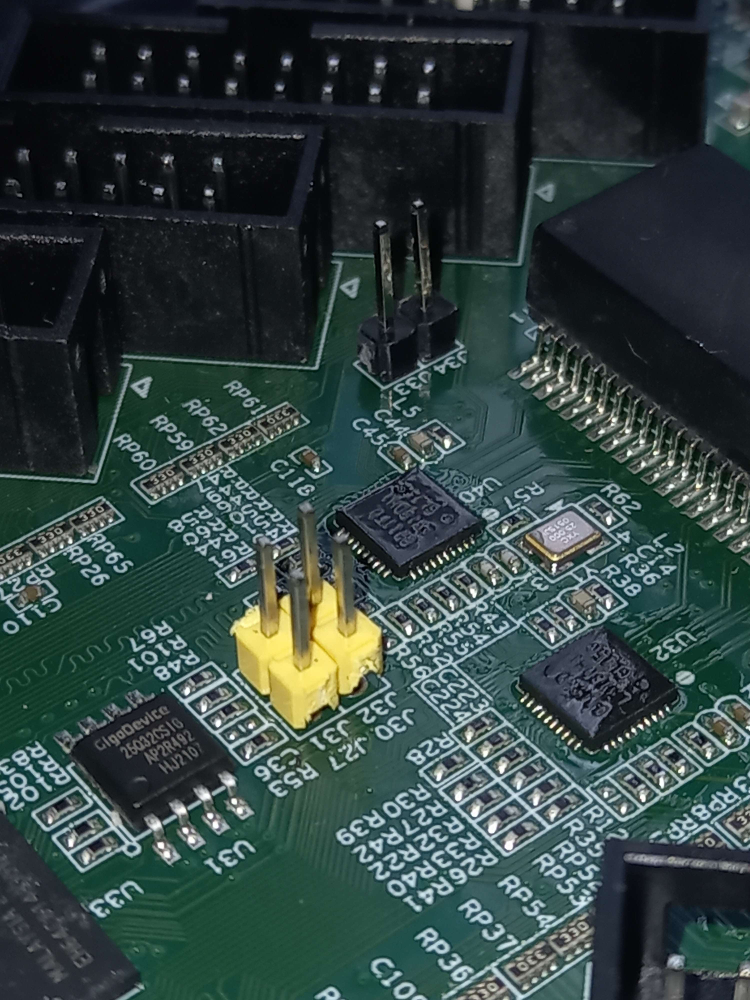
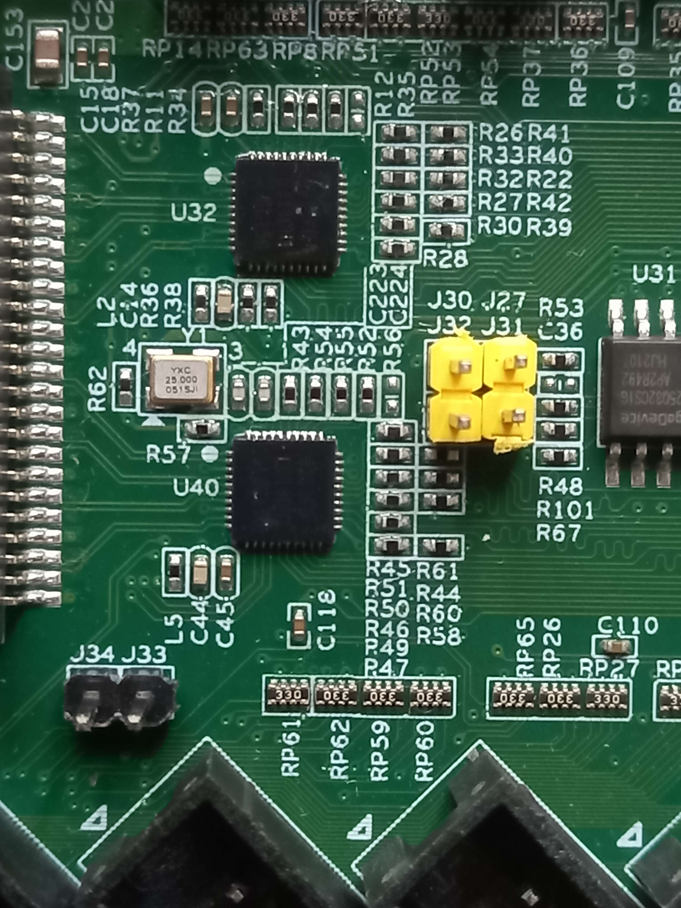
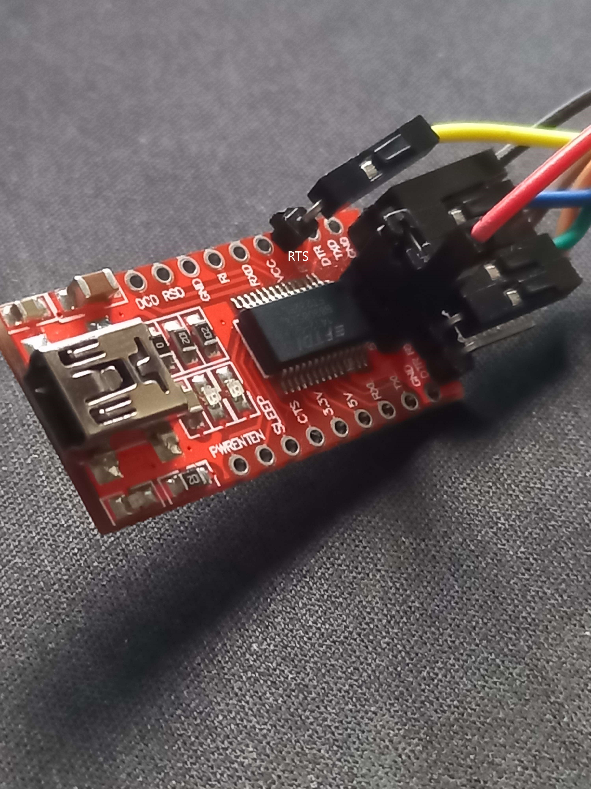
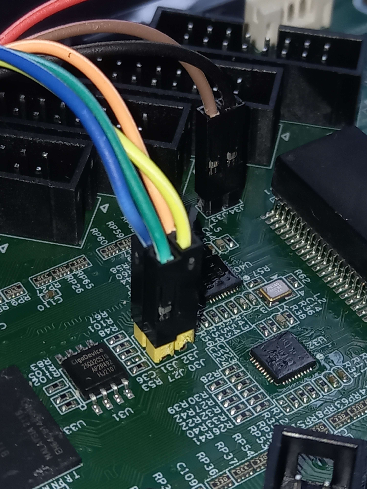

### Introduction

So some day I was talking with my Computer Architecture teacher about FPGAs and at the end we ended up talking about this chinese board "Colorlight 5A-75E".


This board is known as a "Receiver Card" and it is mostly used as a controller for large LED video panels, plus extremely cheap and has interesting specifications.
* FPGA Lattice ECP5 `LFE5U-25F-6BG256C` ([product page](https://www.latticesemi.com/Products/FPGAandCPLD/ECP5))
* Winbond `25Q32JVSIQ`, 32 Mbits SPI flash
* 2x Realtek `RTL8211FD` Gigabit Ethernet PHYs
* 1x ESMT `M12L64322A-5T` 2M x 32bit 200MHz SDRAMs
* 23x `74HC245T` Octal Bidirectional Transceivers (used for level translation to 5V)
* Tons of GPIO pins!

You can read more about the board [here](https://github.com/q3k/chubby75/tree/master/5a-75e).

So since it has a FPGA and JTAG pins, it can programmable however we want using a JTAG programmer (which is the main topic of this blogpost)!

*This is not a tutorial, but more like a blogpost documenting how I did it.*

### Plan

These are the needed components/tools:

- `FTDI232RL` (as JTAG programmer)
- [yosys](https://github.com/YosysHQ/yosys) – Yosys Open SYnthesis Suite
- [nextpnr-ecp5](https://github.com/YosysHQ/nextpnr) - A portable FPGA place and route tool (for ECP5 FPGA)
- [prjtrellis](https://github.com/YosysHQ/prjtrellis) - Provides the device database and tools for bitstream creation
- [openFPGALoader](https://github.com/trabucayre/openFPGALoader) - Universal utility for programming FPGA 

### Using FTDI232RL as a JTAG programmer

`FTDI232RL` is [supported](https://trabucayre.github.io/openFPGALoader/guide/advanced.html#ft231-ft232-bitbang-mode-and-pins-configuration) by `openFPGALoader`, which means we can use it as a JTAG programmer, to upload our bitstream to the FPGA.


In order to use and communicate with the board JTAG pins, my teacher soldered some header pins (J27, J31, J32, 30, J33 and J34 from board and RTS from `FTDI232RL`).





#### Pin mapping

| Connector | Function | FTDI232RL | Color   |
|-----------|----------|-----------|-------- |
| J27       | TCK      | TX        | Green 🟩  |
| J31       | TMS      | CTS       | Blue 🟦   |
| J32       | TDI      | RX        | Orange 🟧 |
| J30       | TDO      | RTS       | Yellow 🟨 |
|           |          |           |
| J33       | 3.3V     | VCC       | Brown 🟫  |
| J34       | GND      | GND       | Black ⬛   |
|           |          |           |
| 5V        | POWER    | 5V        | Red 🟥    |


*The FPGA needs 3.3V in order to work, but the board itself needs 5V.*

#### TODO pin mapping image

This was the result: 



### Setting up open source toolchain

So now that the hardware setup is done, let's go to the software part. The tools described above are needed (in the [plan](#plan) section).

In my case I'm using Arch Linux, so luckily I could find some useful packages:
```sh
> yay -S yosys-nightly nextpnr-ecp5-nightly prjtrellis-nightly 
> pacman -S openfpgaloader
```
These two commands installed all the tools I needed, in your case, you might need to install them differently.

### Uploading Verilog design to ECP5 FPGA

So we have everything we need in order to start programming the FPGA as we want.

I'm not very experienced with Verilog, so while I don't know how to generate VHDL bitstream and upload it, [this public project](https://github.com/wuxx/Colorlight-FPGA-Projects/tree/master/src/i5/blink) can be used as a base template, but we need to change some stuff (because of our programmer). The updated version is [in my repository](https://github.com/roby2014/ecp5-blink).

The project has a `Makefile` that runs all the needed commands.

```
❯ git clone https://github.com/roby2014/ecp5-blink
❯ cd ecp5-blink
❯ make && make prog
make: Nothing to be done for 'all'.
openFPGALoader --cable ft232RL --pins=RXD:RTS:TXD:CTS blink.bit
Jtag probe limited to 3MHz
Jtag frequency : requested 6000000Hz -> real 3000000Hz
ret 0
Open file: DONE
Parse file: DONE
Enable configuration: DONE
SRAM erase: DONE
Loading: [==================================================] 100.00%
Done
Disable configuration: DONE
```

*WARNING: The `FTDI232RL` programmer is a bit different from the others, make sure to read the [openFPGALoader documentation about it](https://trabucayre.github.io/openFPGALoader/guide/advanced.html#ft231-ft232-bitbang-mode-and-pins-configuration). You might need to change the [pin mapping in the Makefile](https://github.com/roby2014/ecp5-blink/blob/main/Makefile#L20) if you connected the wires differently.*

And.... it's blinking! ([video link here](https://streamable.com/kf1x4b))

### References
- [q3k/chubby75](https://github.com/q3k/chubby75) - Reverse engineering information about the Colorlight 5A-75E board.
- [The Colorlight i5 as FPGA development board](https://tomverbeure.github.io/2021/01/22/The-Colorlight-i5-as-FPGA-development-board.html) - Blogpost using a similar board/toolchain.
- [Colorlight FPGA Projects](https://github.com/wuxx/Colorlight-FPGA-Projects) - Some Verilog projects that target Colorlight boards.