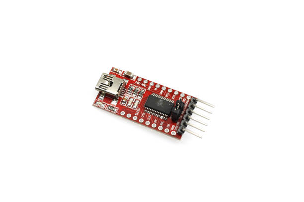
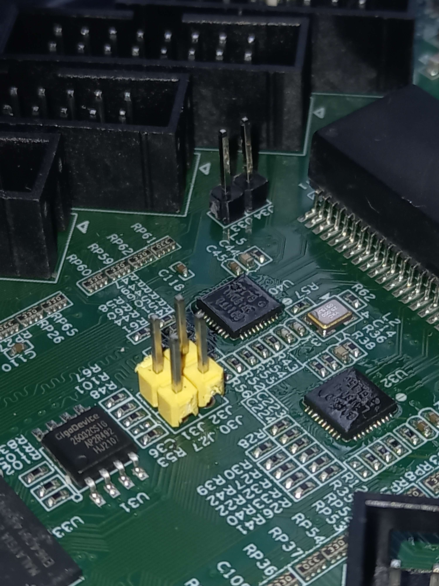
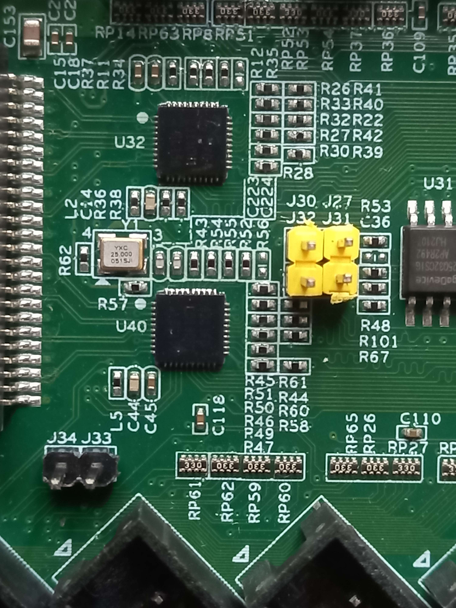
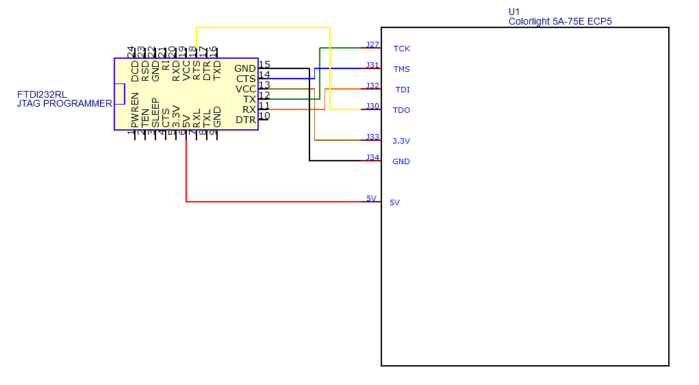
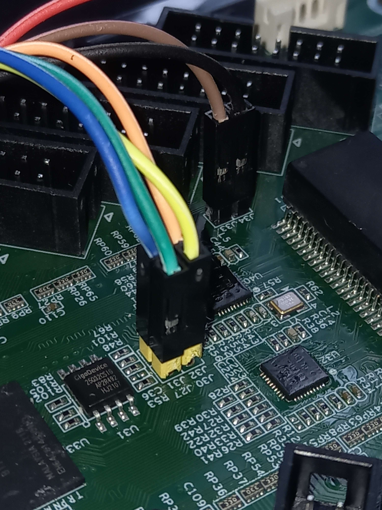
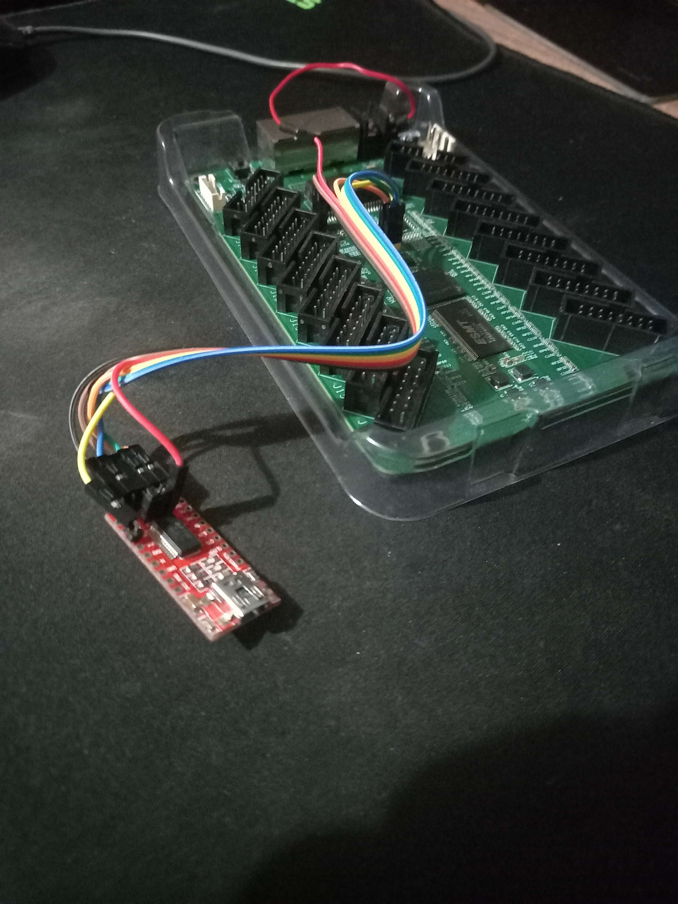

- [Introduction](#introduction)
- [Plan](#plan)
- [Using FTDI232RL as a JTAG programmer](#using-ftdi232rl-as-a-jtag-programmer)
  - [Pin mapping](#pin-mapping)
  - [Notes about FTDI232RL](#notes-about-ftdi232rl)
- [Setting up open source toolchain](#setting-up-open-source-toolchain)
- [Uploading bitstream to ECP5 FPGA](#uploading-bitstream-to-ecp5-fpga)
- [References](#references)

### Introduction

So some day I was talking with my Computer Architecture teacher about FPGAs and at the end we ended up talking about this chinese board "Colorlight 5A-75E".


This board is known as a "Receiver Card" and it is mostly used as a controller for large LED video panels, plus extremely cheap and has interesting specifications.
* FPGA Lattice ECP5 `LFE5U-25F-6BG256C` ([product page](https://www.latticesemi.com/Products/FPGAandCPLD/ECP5))
* Winbond `25Q32JVSIQ`, 32 Mbits SPI flash
* 2x Realtek `RTL8211FD` Gigabit Ethernet PHYs
* 1x ESMT `M12L64322A-5T` 2M x 32bit 200MHz SDRAMs
* 23x `74HC245T` Octal Bidirectional Transceivers (used for level translation to 5V)
* Tons of GPIO pins!

You can read more about the board [here](https://github.com/q3k/chubby75/tree/master/5a-75e).

So since it has a FPGA and JTAG pins, it can be programmable however we want using a JTAG programmer.

### Plan

These are the needed components/tools:

- `FTDI232RL` (as JTAG programmer)
- [yosys](https://github.com/YosysHQ/yosys) – Yosys Open SYnthesis Suite
- [nextpnr-ecp5](https://github.com/YosysHQ/nextpnr) - A portable FPGA place and route tool (for ECP5 FPGA)
- [prjtrellis](https://github.com/YosysHQ/prjtrellis) - Provides the device database and tools for bitstream creation
- [openFPGALoader](https://github.com/trabucayre/openFPGALoader) - Universal utility for programming FPGA 

### Using FTDI232RL as a JTAG programmer

`FTDI232RL` is [supported](https://trabucayre.github.io/openFPGALoader/guide/advanced.html#ft231-ft232-bitbang-mode-and-pins-configuration) ([not out of the box tho!](#notes-about-ftdi232rl)) by `openFPGALoader`, which means we can use it as a JTAG programmer, to upload our bitstream to the FPGA.



In order to use and communicate with the board JTAG pins, my teacher soldered some header pins (J27, J31, J32, J30, J33 and J34 from board and RTS from `FTDI232RL`).






#### Pin mapping

| Connector | Function | FTDI232RL | Color   |
|-----------|----------|-----------|-------- |
| J27       | TCK      | TX        | Green 🟩  |
| J31       | TMS      | CTS       | Blue 🟦   |
| J32       | TDI      | RX        | Orange 🟧 |
| J30       | TDO      | RTS       | Yellow 🟨 |
|           |          |           |
| J33       | 3.3V     | VCC       | Brown 🟫  |
| J34       | GND      | GND       | Black ⬛   |
|           |          |           |
| 5V        | POWER    | 5V        | Red 🟥    |


*JUMPER should be on 3.3V, so VCC is 3.3V.*
*The FPGA needs 3.3V in order to work, but the board itself needs 5V.*

#### Notes about FTDI232RL

Using `FTDI232RL` as a JTAG programmer is a bit different from the others, make sure to read the [openFPGALoader documentation about it](https://trabucayre.github.io/openFPGALoader/guide/advanced.html#ft231-ft232-bitbang-mode-and-pins-configuration) (it requires two special arguments (`--pins` and `--cable`)). 

I recommend using my pin map/wires connection, if you did not, you might need to change the `--pins` argument when invoking `openFPGALoader` to send the bitstream.



This was the result: 




### Setting up open source toolchain

So now that the hardware setup is done, let's go to the software part. The tools described above are needed (in the [plan](#plan) section). 

The cool thing about this board is that we can program it using a fully open source toolchain! 

In my case I'm using Arch Linux (haha), so luckily I could find some useful packages:
```sh
> yay -S yosys-nightly nextpnr-ecp5-nightly prjtrellis-nightly 
> pacman -S openfpgaloader
```

These two commands installed all the tools I needed, in your case, you might need to install them differently.

### Uploading bitstream to ECP5 FPGA

So we have everything we need in order to start programming the FPGA as we want.

You can find a simple example project [on my repository](https://github.com/roby2014/ecp5-ft232rl-example) (VHDL + Verilog + SpinalHDL examples).

The project has a `Makefile` that runs all the needed commands, and programs your board.

```sh
❯ git clone https://github.com/roby2014/ecp5-ft232rl-example
❯ cd ecp5-ft232rl-example/verilog_example
❯ make
openFPGALoader --cable ft232RL --pins=RXD:RTS:TXD:CTS led_control.bit
Jtag probe limited to 3MHz
Jtag frequency : requested 6000000Hz -> real 3000000Hz
ret 0
Open file: DONE
Parse file: DONE
Enable configuration: DONE
SRAM erase: DONE
Loading: [==================================================] 100.00%
Done
Disable configuration: DONE
```

And.... it works :) You should be able to control your LED via INPUT button.

When running `make`, this is what happens "under the hood":
- `yosys` synthetizes the Verilog/Vhdl files, generating a json file with the RTL information.
- `nextpnr-ecp5` transforms synthetized RTL code and pin mapping (lpf file) into a FPGA config file.
- `ecppack` generates bitstream from the configuration file.
- `openFPGALoader` uploads the bitstream into the FPGA via JTAG.


### References
- [q3k/chubby75](https://github.com/q3k/chubby75) - Reverse engineering information about the Colorlight 5A-75E board.
- [yosys](https://github.com/YosysHQ/yosys) – Yosys Open SYnthesis Suite.
- [nextpnr-ecp5](https://github.com/YosysHQ/nextpnr) - A portable FPGA place and route tool (for ECP5 FPGA).
- [prjtrellis](https://github.com/YosysHQ/prjtrellis) - Provides the device database and tools for bitstream creation.
- [openFPGALoader](https://github.com/trabucayre/openFPGALoader) - Universal utility for programming FPGA.
- [The Colorlight i5 as FPGA development board](https://tomverbeure.github.io/2021/01/22/The-Colorlight-i5-as-FPGA-development-board.html) - Blogpost using a similar board/toolchain.
- [Colorlight FPGA Projects](https://github.com/wuxx/Colorlight-FPGA-Projects) - Some Verilog projects that target Colorlight boards.
